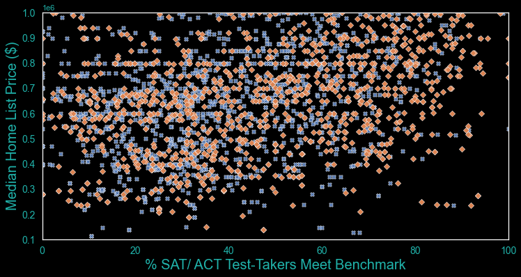
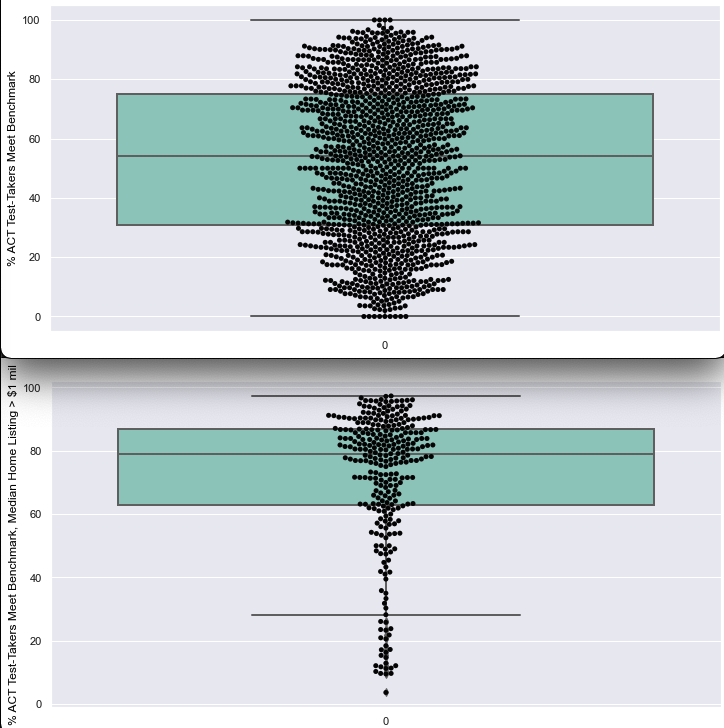

#  Project 1: Property Value vs. Standardized Test Benchmakrs

## Problem Statement

California has enacted policies in reponse to judicial rulings and legislative mandates over the last few decades in response to inequalites in school funding based on property tax revenue; mandating equal funding for all schools should minimize academic achievement discrepancies, so median home values for the zip code in which a school is should not track educational perfomance. 

Have the enacted policies served to close benchmarks gaps previously attributed to discrepancies due to property-value/tax - based funding?

---
## Findings

SAT and ACT scores do not necessarily track with property values, but low-median list price zip codes have fewer schools with high benchmarks. 

ACT scores have much higher distribution among schools in zip does with median list value greater than $1 million. 

---
## Datasets Used: Provided Data  

* [`act_2019_ca.csv`](./data/act_2019_ca.csv): 2019 ACT Scores in California by School ([source](https://www.cde.ca.gov/ds/sp/ai) | [data dictionary]
* [`sat_2019_ca.csv`](./data/sat_2019_ca.csv): 2019 SAT Scores in California by School ([source](https://www.cde.ca.gov/ds/sp/ai/) | [data dictionary]

---

## Datasets Used: External Data  
* [`pubschls.xlsx`](./data/pubschls.xlsx): California Public School Codes & Addresses ([source](https://www.cde.ca.gov/ds/sp/ai/) | [data dictionary]
* [`realtor.csv`](./data/realtor.csv): Home Sale List Prices by Zip ([source](https://econdata.s3-us-west-2.amazonaws.com/Reports/Core/RDC_Inventory_Core_Metrics_Zip_History.csv') | [data dictionary]

---

## Data Dictionaries

`act_2019_ca` DataFrame (source: https://www.cde.ca.gov/search/advsearch.asp)

| Col. Name  | DType     | Description |
| ---------- | --------- | ----- |
| cds        | float64   | county/district/school code |
| rtype      | object    | record type: c=county, d=district, s=school, x=state | 
| sname      | object    |  school |
| danme      | object    | district |
| cname      | object    |  county |
| enroll12   | float64   | 12th grade enrollment|
| numtsttakr | float64   | total number of test-takers | 
| avgscreng  | float64   | average english score |
| avgscrread | float64   | average reading score |
| avgscrmath | float64   | average average math score |
| acgscrsci  | float64   | average science score|
| numge21    | float64   | number  test-takers ACT with composite score > 21 |
| pctge21    | float64   | % test-takers ACT with composite score > 21 |
| year       | object    | academic year of administration  |

`sat_2019_ca` DataFrame (source: https://www.cde.ca.gov/search/advsearch.asp)
| name      | dtype         | description |
| --------- | ------------- | ----------- |
| cds       | float64       | county/district/school code |
| ccode     | float64       | county Code |
| cdcode    | float64       | district Code |
| scode     | float64       | school Code|
| rtype     | object        | record type: c=county, d=district, s=school, x=state | 
| sname     | object        | school |
| danme     | object        | district |
| cname     | object        | county |
| enroll1   | float64       | 12th grade enrollment |
| numtsttakr | float64      | total number of test-takers |
|numerwbenchmark12| float64 | number of students meeting evidence-based reading and writing, grade 12 |
|pcterwbenchmark12| float64 | percent of students meeting evidence-based reading and writing, grade 12 |
|nummathbenchmark12| float64| number of students meeting math benchmark,  grade 12 |
|pctmathbenchmark12| float64| percent of students meeting math benchmark, grade 12 |
|enroll11          | float64| enrollment, grade 11 |
|numtsttakr11      | float64| number of test-takers, grade 11 |
|numerwbenchmark11| float64 | number of students meeting evidence-based reading and writing, grade 11 |
|pcterwbenchmark11| float64 | percent of students meeting evidence-based reading and writing, grade 11 | 
|nummathbenchmark11| float64| number of students meeting math benchmark,  grade 11 |
|pctmathbenchmark11| float64| percent of students meeting math benchmark, grade 11 |
|totnumbothbenchmark12  | float64   | total number of students that met both benchmarks, grade 12 | 
|pctbothbenchmark12     | float64   | percent number of students that met both benchmarks, grade 12 | 
|totnumbothbenchmark11  | float64   | total number of students that met both benchmarks, grade 11 | 
|pctbothbenchmark11     | float64   | percent number of students that met both benchmarks, grade 11 | 
|year                   | object    | test-administered year|

---
`realtor.csv` DataFrame (source: https://econdata.s3-us-west-2.amazonaws.com/Reports/Core/RDC_Inventory_Core_Metrics_Zip_History.csv)

| Col. Name                 | DType     | Description |
| ----------                | --------- | ----- |
| month_date_yyyymm         | float64   | date of listing | 
| postal_code               | float64   | zip code | 
| median_listing_price      | float64   | median listing price |
| median_listing_price_mm   | float64   | median listing price change month-month |
| median_listing_price_yy   | float64   | median listing price change year-year |
| average_listing_price     | float64   | average listing price |
| average_listing_price_mm  | float64   | median listing price change month-month |
| average_listing_price_yy  | float64   | median listing price change year-year |

---